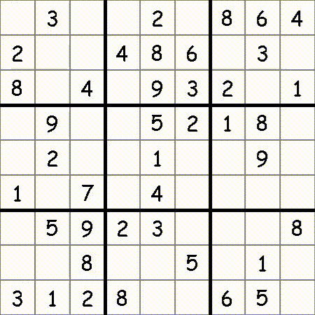

# 🚨**About this repo**🚨

## Language: 

**Python**  

This repository includes a Sudoku solver in both text and GUI form. The solver implements a backtracking algorithm to solve the board.

## How to use:
### Text version
1. Run the following command: `python "sudoku_solver_text.py"`
1. Enter a number between 1 and 3 to determine difficulty
### GUI version
1. Run the following command: `python "sudoku_solver_GUI.py"` 
1. Enter a number between 1 and 3 to determine difficulty
1. To choose a cell to edit, either click on it or use the arrow keys to move from one cell to the other
1. To temporarly place a number click on a number from 1 - 9
1. To lock in the number choose the cell and click Enter
1. To remove a number from a cell after being locked in simply click Backspace
1. The game will automatically check if the board has been solved
1. **Finally to let the A.I. solve the entire board using backtracking click Space**
***
## Screenshots:

***
